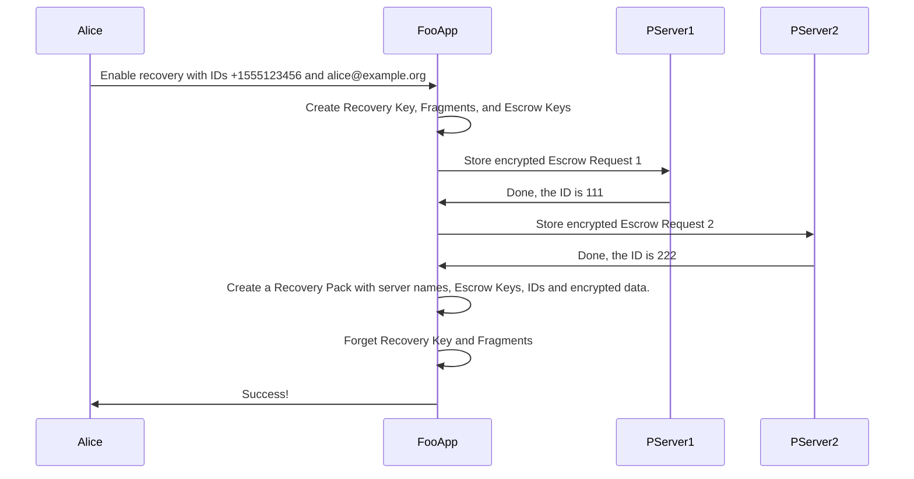
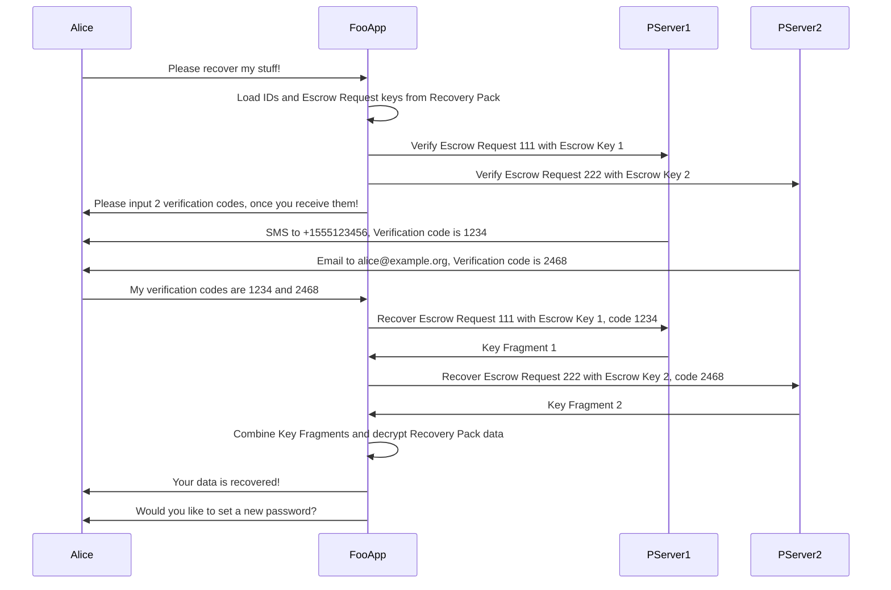

# Passcrow

## What is Passcrow?

Passcrow is an attempt to bring "password reset" functionality to
applications using strong encryption, without sacrificing security.

It does this by encrypting sensitive data locally, but placing fragments
of a recovery key in escrow with community-run servers, which only release
the fragments if the user proves their identity somehow.

Potential applications include password managers, general purpose
encryption tools (including OpenPGP and hard drive encryption) and
cryptocurrency wallets. Passcrow may also be useful for recovering
access to encrypted data, in the case where the owner has died or
become otherwise incapacitated.

Passcrow is a spin-off from Mailpile (<https://www.mailpile.is/>), the
secure e-mail client. Passcrow is inspired by Mailpile's experience and
will be used in future versions of the app.

See also: [The FAQ](FAQ.md), [Installation guides](../README.md)

### What is Passcrow not?

Passcrow is not a password manager.

Passcrow is not a general purpose backup tool.

Passcrow is not a general purpose online data storage.

Passcrow is not a cryptocurrency and does not use a blockchain.

Passcrow is not a [government surveillance](https://www.schneier.com/academic/archives/1997/04/the_risks_of_key_rec.html)
back-door.

### Motivation

Most people have become accustomed to being able to easily recover from a
forgotten or lost password.

In "cloud" scenarios, this is usually done by using an out-of-band channel
(e-mail or SMS are both common) to verify that the reset request is
legitimate and then allow the user to choose a new password. This works,
because the user's data is not encrypted - the service provider has full
access to the data and can issue new credentials at any time (and to
anyone: including law enforcement, insiders or hackers).

This is not true of systems which correctly use strong encryption; the
point of encryption is to mathematically deny access to unauthorized third
parties. In practice, most such systems hinge upon asking the user to
"choose a good password" and then "keep it safe" - whatever that means!

This is a terrible user experience; most users lack the skills to both
choose a strong password and keep it safe, this is a burden which harms
usability and mistakes are very common.

(Password-less strategies such as hardware tokens have their own failure
modes, including loss, theft or malfunction.)

It is also a factor that users are asked to make choices about passwords
and data security very early, in many cases before they have invested in
use of the application and before they understand to what degree the data
in the app is valuable or security sensitive. Nobody who lost their 2010
Bitcoin wallet could know it might be worth millions of dollars a decade
later.

When it comes to encrypting user data (e-mail, hard drives, etc.), the
ability to recover from a lost or forgotten password (or for example a
malfunctioning hardware security token) is absolutely vital. Without it,
encryption of user data poses an almost unacceptable risk of data loss to
all but the most security sensitive users.

To put it another way, for most users reliability is far more imporant
than absolute privacy. Those of us who want to improve privacy, by
advocating for more use of strong encryption, need to address legitimate
concerns about reliability in the process.

Passcrow is an attempt to address these problems and "square the circle"
of secure encryption, with the ability to recover from lost credentials.

---------------------------------------------------------------------------

## User Experience

From the point of view of the user, the Passcrow system implies the
following user interactions for an app which wants to make use of it.

### Setup

   * The app requests permission to allow password resets/recovery
      1. The user provides e-mail addresses and/or cell phone numbers
      2. The user chooses a reset policy (require all, accept any, N of M)

### Recovery

   1. The user triggers a "password reset"
      * The user is informed that codes have been sent via e-mail and/or SMS
   2. The user inputs all recieved codes into the app
   3. The user chooses a new password

### Renewal

   1. About 1x per year, the user should be reminded they have recovery
      enabled, and asked whether they want to make any changes; if they
      choose to make changes, this becomes the Setup interaction.

If the app developer chooses to keep things as simple as possible, they
can choose to only prompt for a single recovery method (e-mail or SMS),
or decide on the user's behalf which policy to use.

This is deliberately very similar to the "password reset" flow provided by
popular "software as a service" systems.

---------------------------------------------------------------------------

## How Does It Work?

### Preparation

1. A "Recovery Key", is randomly created and split into multiple Fragments
   using Shamir's Secret Sharing algorithm, (at least) one Fragment for
   each identity the user intends to use for verification.
   
2. Since Shamir requires at least 3 fragments, but the user may only have
   provied 1 or 2 identities, Extra Fragments may be stored (cleartext) in
   the Recovery Pack itself (see below). Care is taken that these local
   fragments are never enough to reconstruct the Recovery Key on their own.

3. Each (identity, Fragment) pair is put in escrow with a Passcrow Server.
   Escrow Requests are themselves encrypted using randomly generated Escrow
   Keys which are also stored locally.

4. The passcrow-enabled application stores locally a "Recovery Pack", which 
   contains all of the information needed to initiate recovery:
   Recovery Data (encrypted using the Recovery Key), Extra Fragments (if any),
   and for each Fragment, a Passcrow Server name, Escrow ID and Escrow Keys.

#### Illustrated example

This sequence diagram illustrates the Preparation step for a hypthetical user
Alice, who wants to use one phone number and one e-mail address for recovery:

### Recovery

1. When recovery is initiated, the passcrow-enabled application contacts
   all Passcrow servers listed in the Recovery Pack, providing each with
   the key required to decrypt the Escrow Request they have in storage.

2. **Optional:** The Passcrow Servers may notify the user that recovery
   has been requested.

3. **Optional:** One or more Passcrow Servers may ask the application to
   direct the user to a web-page (a URL) to verify their identity.

4. The identification process results in the user receiving one or more
   "Verification Codes", which they input into the passcrow-enabled
   application. Once the application has collected sufficient codes, it
   provides those to the Passcrow Servers and receives the Recovery Key
   Fragment(s) in return.

5. This allows the application to reconstruct the Recovery Key and decrypt
   the secret data in the Recovery Pack, thus granting access to locally
   encrypted data.

#### Illustrated example, cont'd

This sequence diagram illustrates the Recovery step, for the same hypthetical
Alice as above:

### Notes

This process provides the following guarantees:

1. The user's encryption keys and data never leaves their device

2. Users of the system remain anonymous and the Passcrow Servers have no
   access to user data (identities) until recovery is initiated.

3. The application (or user) can adjust and balance reliability against
   security, by relying on multiple Passcrow Servers and tuning "N-of-M"
   parameters when generating key fragments and choosing identity
   verification strategies.

4. Key generation and policy decisions are entirely client side, so
   applications with specific needs have the option of implementing more
   complicated policies than Shamir's "N-of-M", while still using the same
   protocol and the same servers.

The process also has the following characteristics, assuming the Passcrow
Servers are well implemented and not malicious:

1. Recovery does not take place without informing the user.

2. Clear-text user data and Recovery Key Fragments are only kept in RAM,
   and only for a limited time.

3. Communications between the application and Passcrow Servers can be
   anonymous and strongly encrypted, e.g. over HTTPS and/or Tor.

4. No constraints are placed on *how* identities are verified by the
   servers. In the simple case, an SMS or an e-mail may be sent with a
   code, but it would also be possible to video-call a person or require
   they log in to a website using OAuth, or pay $10 using a particular
   PayPal account or a credit-card.

**FIXME:** *Describe Ephemeral Passcrow. tl;dr: escrowing the Recovery Pack*

---------------------------------------------------------------------------

## Protocol

Passcrow is an HTTP-based protocol which defines the following methods.
All parameters and responses are encapsulated in JSON objects as described
in the Data Structures chapter below.

Check the server's policy regarding token generation and supported
features, expiration times, etc. Note this method may also return a valid
access token if the user is authenticated using HTTP Auth or cookies.

    GET /passcrow/policy
        <- (<POLICY OBJECT>)

To put a secret in escrow (requires 1 or more valid tokens):

    POST /passcrow/protect
        -> (<ESCROW REQUEST>)
        <- (<ESCROW RESPONSE>)

To initiate recovery (verify identity) of a secret from escrow:

    POST /passcrow/verify
        -> (<VERIFICATION REQUEST>)
        <- (<VERIFICATION RESPONSE>)

To recover a secret from escrow:

    POST /passcrow/recover
        -> (<RECOVERY REQUEST>)
        <- (<RECOVERY RESPONSE>)

To delete a secret from escrow:

    POST /passcrow/delete
        -> (<DELETION REQUEST>)
        <- (<DELETION RESPONSE>)

## Data Structures

**NOTE:** This section is unfinished and under development. See
[`passcrow.proto`](../passcrow/proto.py) for current definitions.

### Escrow Request

    {
        "passcrow-escrow-request": "1.0",
        "parameters-key": <ENCRYPTION KEY>,
        "parameters": <PARAMETERS OBJECT>,
        "escrow-data": <ESCROW DATA OBJECT>
    }

The "parameters" and "escrow-data" fields are base64-encoded, encrypted
JSON objects. The "parameters-key" is a base64-encoded key which can be
used to decode the parameters object.

The purpose of this is to validate that the encryption schemes used by
the client and server are compatible and that the server will be capable
of decrypting the escrow data when (if) it becomes necessary.

See below for details on the encryption scheme.

...

**FIXME:** *write more docs*
